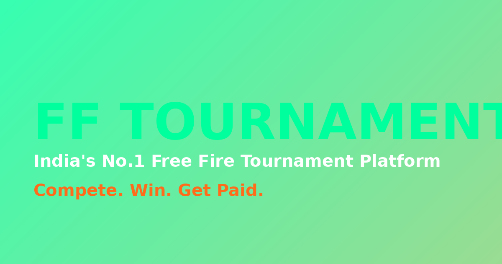

# 🏆 FF Tournament — India's No.1 Free Fire Tournament Platform

A production-ready Progressive Web App (PWA) for hosting Free Fire custom tournaments. Built with Next.js, TypeScript, Tailwind CSS, Framer Motion, and a clean architecture that can run on SQLite (demo) or Firebase (production).

> **Tagline:** Join exciting Free Fire custom tournaments, compete with real players, and win cash prizes.



---

## 📋 Table of Contents

1. [Features](#-features)
2. [Tech Stack](#-tech-stack)
3. [Quick Start](#-quick-start)
4. [Project Structure](#-project-structure)
5. [Database Schema](#-database-schema)
6. [Authentication](#-authentication)
7. [API Reference](#-api-reference)
8. [PWA Setup](#-pwa-setup)
9. [Firebase Migration Guide](#-firebase-migration-guide)
10. [Firestore Security Rules](#-firestore-security-rules)
11. [Admin Setup](#-admin-setup)
12. [Deployment Guide](#-deployment-guide)
13. [GitHub Setup](#-github-setup)
14. [Environment Variables](#-environment-variables)
15. [Troubleshooting](#-troubleshooting)

---

## ✨ Features

### User-Facing
- 🎮 **1v1 & 2v2 Clash Squad** tournaments with cash prizes
- 🔐 **Google Login** (Firebase Auth) with secure session management
- 💳 **UPI Payment Flow** — QR code, UPI ID, screenshot upload, UTR verification
- 📊 **User Dashboard** — upcoming matches, joined tournaments, payment status, notifications, match history, prize history
- 🏆 **Leaderboard** — top winners, most matches played, highest prize earned
- 🔔 **Real-time Notifications** — payment approved/rejected, room published, tournament completed
- 📱 **PWA** — installable, offline support, splash screen, app icons
- 🎨 **Dark Gaming Theme** — neon green + orange accents, glassmorphism, glow effects

### Admin Panel
- 📈 **Dashboard Statistics** — total users, registrations, payments (pending/approved/rejected), active/completed tournaments
- 🏟️ **Tournament Management** — create, edit, delete, activate/deactivate
- 💰 **Payment Verification** — view screenshot, UTR, player details; approve/reject
- 🔑 **Room Management** — publish Room ID & Password (visible only to approved players)
- 🏆 **Match Completion** — mark tournament completed, select winner, enter prize amount
- 📊 Auto-updates **leaderboard**, **winner history**, **user prize history**

### Design & UX
- ⚡ **Framer Motion** animations (hover, fade, page transitions, counters, loading skeletons, glow effects)
- 📱 **Mobile-first responsive** — Android, iPhone, tablet, desktop
- 🌈 **Color palette**: Black `#050507`, Dark Gray `#0c0c12`, Neon Green `#00ff9d`, Orange `#ff6b1a`, White `#f4f4f5`
- ♿ **Accessibility** — semantic HTML, ARIA labels, keyboard navigation, screen reader support
- 🔍 **SEO Optimized** — metadata, Open Graph, Twitter cards, sitemap, robots.txt

---

## 🛠 Tech Stack

| Layer | Technology | Notes |
|-------|-----------|-------|
| Framework | **Next.js 16** (App Router) | Runs on Next.js 15+ too |
| Language | **TypeScript 5** | Strict mode |
| Styling | **Tailwind CSS 4** + shadcn/ui | Dark theme |
| Animations | **Framer Motion 12** | |
| State | **Zustand** + **TanStack Query** | Client + server state |
| Auth | Custom HMAC sessions *(demo)* / **Firebase Auth** *(production)* | |
| Database | **Prisma + SQLite** *(demo)* / **Firebase Firestore** *(production)* | |
| File Storage | Base64 in DB *(demo)* / **Firebase Storage** *(production)* | |
| PWA | Web Manifest + Service Worker | |
| Deployment | **Vercel** | |
| Version Control | **GitHub** | |

---

## 🚀 Quick Start

### Prerequisites
- Node.js 18+ (or [Bun](https://bun.sh) 1.1+)
- npm / bun / pnpm

### Install & Run

```bash
# 1. Clone the repo
git clone https://github.com/YOUR_USERNAME/ff-tournament.git
cd ff-tournament

# 2. Install dependencies
bun install  # or: npm install

# 3. Set up environment variables
cp .env.example .env
# Edit .env with your values (see Environment Variables section)

# 4. Push database schema
bun run db:push  # or: npx prisma db push

# 5. Start dev server
bun run dev  # or: npm run dev

# 6. Open http://localhost:3000
```

### Demo Login

For instant testing without Firebase setup:

| Role | How to login |
|------|--------------|
| **Player** | Click "Login" → "Google Login" → "Continue with Google" (creates demo user) |
| **Admin** | Click "Login" → "Email Login" → use email ending in `@admin.in` (e.g. `admin@fftournament.in`) |

### Seed Demo Data

The app auto-seeds 4 demo tournaments on first load. To manually re-seed:

```bash
curl -X POST http://localhost:3000/api/seed
```

---

## 📁 Project Structure

```
ff-tournament/
├── prisma/
│   └── schema.prisma              # Database schema (mirrors Firestore collections)
├── public/
│   ├── manifest.json              # PWA manifest
│   ├── sw.js                      # Service Worker
│   ├── offline.html               # Offline fallback page
│   ├── icon-192.png               # PWA icon (192x192)
│   ├── icon-512.png               # PWA icon (512x512)
│   ├── og-image.png               # Open Graph image
│   └── screenshot-mobile.png      # PWA screenshot
├── scripts/
│   └── generate-icons.py          # Icon generation script
├── src/
│   ├── app/
│   │   ├── layout.tsx             # Root layout (PWA metadata, providers)
│   │   ├── page.tsx               # Home page (all sections)
│   │   ├── globals.css            # Dark gaming theme + animations
│   │   └── api/
│   │       ├── auth/              # /google, /email, /logout, /me
│   │       ├── tournaments/       # /, /detail
│   │       ├── registrations/     # POST (register + payment)
│   │       ├── payments/          # GET, POST (verify)
│   │       ├── admin/             # /tournaments, /rooms, /complete, /stats
│   │       ├── notifications/     # GET, POST (mark read)
│   │       ├── leaderboard/       # GET
│   │       ├── stats/             # GET (homepage counters)
│   │       ├── dashboard/         # GET (user dashboard data)
│   │       └── seed/              # POST (seed demo data)
│   ├── components/
│   │   ├── ui/                    # shadcn/ui primitives
│   │   ├── sections/              # Homepage sections (hero, banner, stats, etc.)
│   │   ├── modals/                # Login, Tournament, Payment, Dashboard, Admin, Info
│   │   ├── auth-provider.tsx      # Auth context
│   │   └── providers.tsx          # QueryClient, Tooltip, Auth, SW registration
│   ├── lib/
│   │   ├── auth.ts                # HMAC session management
│   │   ├── constants.ts           # Trust cards, FAQs, announcements
│   │   ├── db.ts                  # Prisma client
│   │   └── utils.ts               # cn() helper
│   ├── stores/
│   │   └── ui-store.ts            # Zustand modal/scroll state
│   └── hooks/
│       ├── use-mobile.ts
│       └── use-toast.ts
├── .env.example
├── Caddyfile                      # Reverse proxy config
├── package.json
└── README.md
```

---

## 🗄 Database Schema

The Prisma schema (`prisma/schema.prisma`) mirrors the Firestore collections described below. Each model maps 1:1 to a Firestore collection.

### Collections Overview

| Collection | Purpose |
|-----------|---------|
| `users` | Player & admin profiles (uid, name, email, photoURL, role, registeredAt) |
| `tournaments` | Tournament config (type, entryFee, prize, slots, date, room) |
| `registrations` | User ↔ Tournament join (status: pending/approved/rejected) |
| `paymentRequests` | Payment proof (screenshotURL, utrNumber, status) |
| `notifications` | User notifications (payment_approved, room_published, etc.) |
| `leaderboard` | Aggregated stats per user (matchesPlayed, wins, prizeEarned) |
| `prizeHistory` | Record of each prize won (userId, tournamentId, amount) |
| `announcements` | Marquee bar messages |
| `settings` | App-wide settings (UPI ID, payee name, etc.) |

### Key Relationships

```
User 1───* Registration *───1 Tournament
User 1───* PaymentRequest *───1 Tournament
Registration 1───1 PaymentRequest
Tournament 1───* PrizeHistory *───1 User
User 1───1 Leaderboard
User 1───* Notification
```

---

## 🔐 Authentication

### Demo Mode (default)

The app ships with a **stateless HMAC-signed session** system that works without any external auth provider:

1. **Google Login** — creates a demo Google user (`player.google@fftournament.in`)
2. **Email Login** — creates/finds user by email; emails ending in `@admin.in` get admin role
3. **Session** — HMAC-signed cookie (`ff_session`) with 7-day TTL, verified server-side

This is perfect for development and demos. For production, swap to Firebase Auth (see below).

### Production Mode (Firebase Auth)

To use real Firebase Google Sign-In:

1. **Install Firebase SDK:**
   ```bash
   bun add firebase
   ```

2. **Create `src/lib/firebase.ts`:**
   ```typescript
   import { initializeApp } from "firebase/app";
   import { getAuth, GoogleAuthProvider } from "firebase/auth";
   import { getFirestore } from "firebase/firestore";
   import { getStorage } from "firebase/storage";

   const firebaseConfig = {
     apiKey: process.env.NEXT_PUBLIC_FIREBASE_API_KEY,
     authDomain: process.env.NEXT_PUBLIC_FIREBASE_AUTH_DOMAIN,
     projectId: process.env.NEXT_PUBLIC_FIREBASE_PROJECT_ID,
     storageBucket: process.env.NEXT_PUBLIC_FIREBASE_STORAGE_BUCKET,
     messagingSenderId: process.env.NEXT_PUBLIC_FIREBASE_MESSAGING_SENDER_ID,
     appId: process.env.NEXT_PUBLIC_FIREBASE_APP_ID,
   };

   const app = initializeApp(firebaseConfig);
   export const auth = getAuth(app);
   export const googleProvider = new GoogleAuthProvider();
   export const db = getFirestore(app);
   export const storage = getStorage(app);
   ```

3. **Update `src/components/auth-provider.tsx`** to use Firebase Auth:
   ```typescript
   import { signInWithPopup, signOut, onAuthStateChanged } from "firebase/auth";
   import { auth, googleProvider, db } from "@/lib/firebase";
   import { doc, setDoc, getDoc, serverTimestamp } from "firebase/firestore";

   // Google login
   const loginWithGoogle = async () => {
     const result = await signInWithPopup(auth, googleProvider);
     const user = result.user;
     // Create/update user doc in Firestore
     const userRef = doc(db, "users", user.uid);
     const userSnap = await getDoc(userRef);
     if (!userSnap.exists()) {
       await setDoc(userRef, {
         name: user.displayName,
         email: user.email,
         photoURL: user.photoURL,
         uid: user.uid,
         registeredAt: serverTimestamp(),
         role: "user",
       });
     }
   };
   ```

4. **Replace Prisma API routes** with Firestore calls. Each `/api/*` route maps to a Firestore operation.

---

## 📡 API Reference

All routes are under `/api/`. Authentication uses the `ff_session` cookie.

### Auth

| Method | Endpoint | Description | Auth |
|--------|----------|-------------|------|
| `POST` | `/api/auth/google` | Demo Google login (creates session) | Public |
| `POST` | `/api/auth/email` | Email + name login (admin if `@admin.in`) | Public |
| `POST` | `/api/auth/logout` | Clear session | Public |
| `GET` | `/api/auth/me` | Get current user | Public |

### Tournaments

| Method | Endpoint | Description | Auth |
|--------|----------|-------------|------|
| `GET` | `/api/tournaments` | List active tournaments | Public |
| `GET` | `/api/tournaments/detail?id=...` | Get tournament + my registration status | Public |

### Registration & Payments

| Method | Endpoint | Description | Auth |
|--------|----------|-------------|------|
| `POST` | `/api/registrations` | Register + submit payment (screenshot, UTR) | User |
| `GET` | `/api/payments` | List payments (own / all if admin) | User |
| `POST` | `/api/payments` | Approve/reject payment `{ paymentId, action }` | Admin |

### Admin

| Method | Endpoint | Description | Auth |
|--------|----------|-------------|------|
| `GET` | `/api/admin/stats` | Dashboard statistics | Admin |
| `GET` | `/api/admin/tournaments` | List ALL tournaments | Admin |
| `POST` | `/api/admin/tournaments` | Create tournament | Admin |
| `PUT` | `/api/admin/tournaments` | Update tournament | Admin |
| `DELETE` | `/api/admin/tournaments?id=...` | Delete tournament | Admin |
| `POST` | `/api/admin/rooms` | Publish room details | Admin |
| `POST` | `/api/admin/complete` | Mark completed + select winner + enter prize | Admin |

### Other

| Method | Endpoint | Description | Auth |
|--------|----------|-------------|------|
| `GET` | `/api/dashboard` | User dashboard data | User |
| `GET` | `/api/notifications` | User notifications | User |
| `POST` | `/api/notifications` | Mark all as read | User |
| `GET` | `/api/leaderboard` | Top winners, most matches, highest prize | Public |
| `GET` | `/api/stats` | Homepage animated counters | Public |
| `POST` | `/api/seed` | Seed demo data (idempotent) | Public |

---

## 📱 PWA Setup

The app is a fully installable PWA. Key files:

| File | Purpose |
|------|---------|
| `public/manifest.json` | App manifest (name, icons, theme, shortcuts) |
| `public/sw.js` | Service worker (caches app shell, offline fallback) |
| `public/offline.html` | Offline fallback page |
| `public/icon-192.png`, `icon-512.png` | App icons |
| `public/screenshot-mobile.png` | Install prompt screenshot |
| `src/app/layout.tsx` | PWA metadata, apple-mobile-web-app tags |

### Customize PWA

1. **Replace icons** — Edit `scripts/generate-icons.py` and re-run, or drop your own PNGs in `public/`
2. **Update manifest** — Edit `public/manifest.json` (name, shortcuts, screenshots)
3. **Update theme color** — Edit `themeColor` in `src/app/layout.tsx` and `background_color` in manifest

### Install on Mobile

1. Open the deployed URL in Chrome (Android) or Safari (iOS)
2. Browser will prompt "Add to Home Screen"
3. Or use browser menu → "Install app"

---

## 🔥 Firebase Migration Guide

This demo uses Prisma + SQLite for instant setup. For production, migrate to Firebase:

### Step 1: Create Firebase Project

1. Go to [Firebase Console](https://console.firebase.google.com)
2. Create new project → name it `ff-tournament`
3. Enable **Authentication** → Sign-in method → **Google**
4. Create **Firestore Database** (production mode)
5. Create **Storage** bucket
6. Add a Web App → copy the Firebase config

### Step 2: Install Firebase SDK

```bash
bun add firebase
```

### Step 3: Set Environment Variables

```env
NEXT_PUBLIC_FIREBASE_API_KEY=AIza...
NEXT_PUBLIC_FIREBASE_AUTH_DOMAIN=ff-tournament.firebaseapp.com
NEXT_PUBLIC_FIREBASE_PROJECT_ID=ff-tournament
NEXT_PUBLIC_FIREBASE_STORAGE_BUCKET=ff-tournament.appspot.com
NEXT_PUBLIC_FIREBASE_MESSAGING_SENDER_ID=1234567890
NEXT_PUBLIC_FIREBASE_APP_ID=1:1234567890:web:abc123
SESSION_SECRET=your-32-char-min-secret-string
```

### Step 4: Create Firebase Client

Create `src/lib/firebase.ts` (see Authentication section above).

### Step 5: Migrate API Routes

Each Prisma query maps to a Firestore call:

| Prisma Operation | Firestore Equivalent |
|------------------|---------------------|
| `db.user.findUnique({ where: { email } })` | `getDoc(doc(db, "users", uid))` |
| `db.user.create({ data })` | `setDoc(doc(db, "users", uid), data)` |
| `db.tournament.findMany({ where: { status: "active" } })` | `getDocs(query(collection(db, "tournaments"), where("status", "==", "active")))` |
| `db.tournament.create({ data })` | `addDoc(collection(db, "tournaments"), data)` |
| `db.tournament.update({ where: { id }, data })` | `updateDoc(doc(db, "tournaments", id), data)` |
| `db.tournament.delete({ where: { id } })` | `deleteDoc(doc(db, "tournaments", id))` |
| `db.paymentRequest.count({ where })` | `getCountFromServer(query(collection(db, "paymentRequests"), where))` |

### Step 6: Migrate File Storage

Replace base64 screenshot storage with Firebase Storage:

```typescript
import { ref, uploadBytes, getDownloadURL } from "firebase/storage";
import { storage } from "@/lib/firebase";

async function uploadScreenshot(file: File, userId: string): Promise<string> {
  const storageRef = ref(storage, `payments/${userId}/${Date.now()}-${file.name}`);
  await uploadBytes(storageRef, file);
  return getDownloadURL(storageRef);
}
```

### Step 7: Use Firebase Auth on Client

Replace `src/components/auth-provider.tsx` with Firebase Auth (see code snippet in Authentication section).

### Step 8: Delete Prisma (optional)

Once migration is complete:
```bash
bun remove prisma @prisma/client
rm -rf prisma/
rm src/lib/db.ts
```

---

## 🛡 Firestore Security Rules

Copy these to Firebase Console → Firestore → Rules:

```
rules_version = '2';
service cloud.firestore {
  match /databases/{database}/documents {

    // Users: can read own profile, admins can read all
    match /users/{userId} {
      allow read: if request.auth != null && (request.auth.uid == userId || isAdmin());
      allow create: if request.auth != null && request.auth.uid == userId;
      allow update: if request.auth != null && (request.auth.uid == userId || isAdmin());
      allow delete: if isAdmin();
    }

    // Tournaments: public read for active, admin-only write
    match /tournaments/{tournamentId} {
      allow read: if resource.data.status == 'active' || isAdmin();
      allow create, update, delete: if isAdmin();
    }

    // Registrations: user creates own, admin reads all
    match /registrations/{regId} {
      allow read: if request.auth != null && (resource.data.userId == request.auth.uid || isAdmin());
      allow create: if request.auth != null && request.auth.uid == request.resource.data.userId;
      allow update: if isAdmin();
      allow delete: if isAdmin();
    }

    // Payment requests: user creates own, admin verifies
    match /paymentRequests/{paymentId} {
      allow read: if request.auth != null && (resource.data.userId == request.auth.uid || isAdmin());
      allow create: if request.auth != null && request.auth.uid == request.resource.data.userId;
      allow update: if isAdmin();
      allow delete: if isAdmin();
    }

    // Notifications: user reads/updates own only
    match /notifications/{notifId} {
      allow read, update: if request.auth != null && resource.data.userId == request.auth.uid;
      allow create: if isAdmin(); // admin creates notifications for users
      allow delete: if isAdmin();
    }

    // Leaderboard: public read, admin/system write only
    match /leaderboard/{entryId} {
      allow read: if true;
      allow write: if isAdmin();
    }

    // Prize history: user reads own, admin writes
    match /prizeHistory/{entryId} {
      allow read: if request.auth != null && (resource.data.userId == request.auth.uid || isAdmin());
      allow create, update, delete: if isAdmin();
    }

    // Announcements: public read, admin write
    match /announcements/{annId} {
      allow read: if true;
      allow write: if isAdmin();
    }

    // Settings: public read, admin write
    match /settings/{settingId} {
      allow read: if true;
      allow write: if isAdmin();
    }

    // Helper function: check if user is admin
    function isAdmin() {
      return request.auth != null &&
        exists(/databases/$(database)/documents/users/$(request.auth.uid)).data.role == 'admin';
    }
  }
}
```

### Storage Rules (for payment screenshots)

```
rules_version = '2';
service firebase.storage {
  match /b/{bucket}/o {
    // Payment screenshots: only owner can read, only authenticated users can write
    match /payments/{userId}/{fileName} {
      allow read: if request.auth != null && (request.auth.uid == userId || isAdmin());
      allow write: if request.auth != null && request.auth.uid == userId
                   && request.resource.size < 2 * 1024 * 1024
                   && request.resource.contentType.matches('image/.*');
    }

    // Tournament banners: public read, admin write
    match /banners/{fileName} {
      allow read: if true;
      allow write: if isAdmin();
    }

    function isAdmin() {
      return request.auth != null &&
        firestore.get(/databases/(default)/documents/users/$(request.auth.uid)).data.role == 'admin';
    }
  }
}
```

---

## 👑 Admin Setup

### Demo Mode

Any email ending in `@admin.in` automatically gets admin role. Example:
- `admin@fftournament.in` (pre-seeded)
- `owner@admin.in`
- `moderator@admin.in`

### Production (Firebase)

To grant admin role to a user:

1. Open Firebase Console → Firestore
2. Find the user doc in `users` collection
3. Change `role` field from `"user"` to `"admin"`

Or via Firebase CLI:
```bash
firebase firestore:update --project ff-tournament \
  /users/{USER_UID} '{"role":"admin"}'
```

---

## 🚢 Deployment Guide (Vercel)

### Step 1: Push to GitHub

```bash
git init
git add .
git commit -m "Initial commit: FF Tournament PWA"
git branch -M main
git remote add origin https://github.com/YOUR_USERNAME/ff-tournament.git
git push -u origin main
```

### Step 2: Import to Vercel

1. Go to [vercel.com/new](https://vercel.com/new)
2. Import your GitHub repo
3. Framework Preset: **Next.js** (auto-detected)
4. Set Environment Variables (see Environment Variables section)
5. Click **Deploy**

### Step 3: Configure Custom Domain (optional)

1. Vercel Dashboard → Project → Settings → Domains
2. Add your domain (e.g. `fftournament.in`)
3. Add DNS records as instructed

### Step 4: Update Firebase Authorized Domains

In Firebase Console → Authentication → Settings → Authorized domains:
- Add `your-project.vercel.app`
- Add `fftournament.in` (custom domain)

---

## 🐙 GitHub Setup

### Repository Structure

```
ff-tournament/
├── .github/
│   └── workflows/
│       └── ci.yml          # Optional: Lint + type check on PR
├── .gitignore
├── README.md
└── ... (project files)
```

### `.gitignore` (essential entries)

```gitignore
# Dependencies
node_modules/
.pnp
.pnp.js

# Next.js
.next/
out/
build/

# Production
dist/

# Env files
.env
.env.local
.env.production.local
.env.development.local

# Database (SQLite demo)
*.db
*.db-journal
prisma/migrations/

# Misc
.DS_Store
*.pem
.vscode/
.idea/

# Vercel
.vercel

# Logs
*.log
npm-debug.log*
yarn-debug.log*
```

### GitHub Actions CI (optional)

Create `.github/workflows/ci.yml`:

```yaml
name: CI
on: [push, pull_request]
jobs:
  build:
    runs-on: ubuntu-latest
    steps:
      - uses: actions/checkout@v4
      - uses: oven-sh/setup-bun@v1
      - run: bun install
      - run: bun run lint
```

---

## 🔧 Environment Variables

Create `.env` (or `.env.local`) in the project root:

```env
# Database (demo SQLite)
DATABASE_URL="file:./db/custom.db"

# Session secret (use 32+ random chars in production)
# Generate with: openssl rand -hex 32
SESSION_SECRET="change-this-to-a-random-32-char-secret"

# Firebase (production only — see Firebase Migration Guide)
# NEXT_PUBLIC_FIREBASE_API_KEY=
# NEXT_PUBLIC_FIREBASE_AUTH_DOMAIN=
# NEXT_PUBLIC_FIREBASE_PROJECT_ID=
# NEXT_PUBLIC_FIREBASE_STORAGE_BUCKET=
# NEXT_PUBLIC_FIREBASE_MESSAGING_SENDER_ID=
# NEXT_PUBLIC_FIREBASE_APP_ID=

# App config
NEXT_PUBLIC_APP_URL="http://localhost:3000"
```

### Vercel Environment Variables

In Vercel Dashboard → Project → Settings → Environment Variables, add:
- `DATABASE_URL` (only if using Prisma — skip for Firebase)
- `SESSION_SECRET`
- All `NEXT_PUBLIC_FIREBASE_*` variables

---

## 🐛 Troubleshooting

### Common Issues

**1. "Unknown argument" Prisma error after schema change**
- The Prisma client is cached in dev mode. Bump `SCHEMA_VERSION` in `src/lib/db.ts` and reload.
- Or run `bunx prisma generate && bun run dev`

**2. Session lost after dev server restart**
- This was an issue with in-memory session store — fixed by switching to HMAC-signed cookies.
- If you still see this, check that `SESSION_SECRET` is set in `.env`.

**3. FAQ accordion hydration warning**
- The Radix UI Accordion generates different IDs on server vs client.
- Fixed by deferring accordion render to client-side (see `src/components/sections/faq-section.tsx`).

**4. PWA not installable**
- Service worker only registers in production builds. Run `bun run build && bun start`.
- For local testing: deploy to Vercel, or use Chrome DevTools → Application → Manifest.

**5. Login button does nothing**
- Check browser console for errors.
- Verify `/api/auth/me` returns `{"ok": true, "user": {...}}` after login.
- Clear cookies and try again.

**6. Admin panel not visible**
- Admin panel only appears for users with `role: "admin"`.
- In demo: login with email ending in `@admin.in`.
- In production: update `role` field in Firestore `users` collection.

**7. Payment screenshot upload fails**
- Max file size is 2MB.
- Only image files (PNG, JPG) are accepted.
- In production, swap base64 storage with Firebase Storage (see migration guide).

### Getting Help

- 💬 Telegram: [@fftournament](https://t.me/fftournament)
- 📷 Instagram: [@ff.tournament.india](https://instagram.com/ff.tournament.india)
- 📧 Email: support@fftournament.in

---

## 📄 License

MIT License — feel free to use this project for your own Free Fire tournament platform.

---

## 🙏 Credits

Built with ❤️ for Indian Free Fire gamers. Powered by Next.js, Tailwind CSS, shadcn/ui, Framer Motion, and Firebase.

**Made for gamers, by gamers.** 🎮🏆
